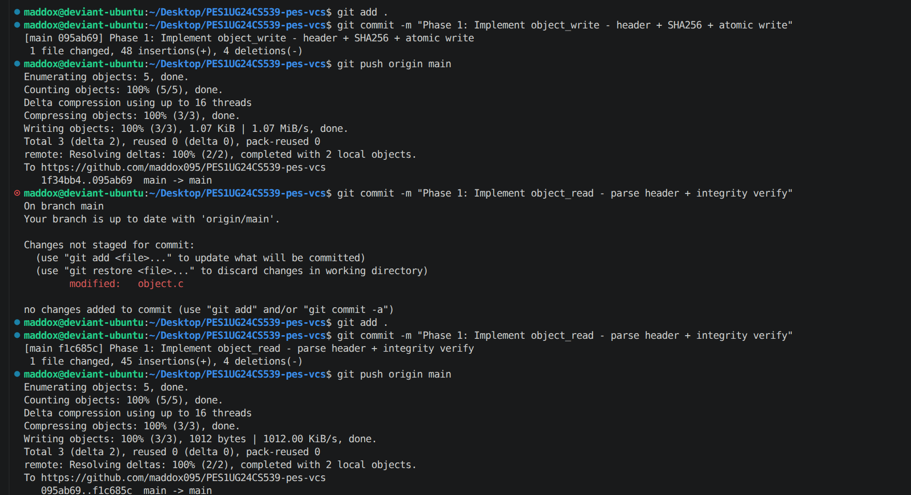
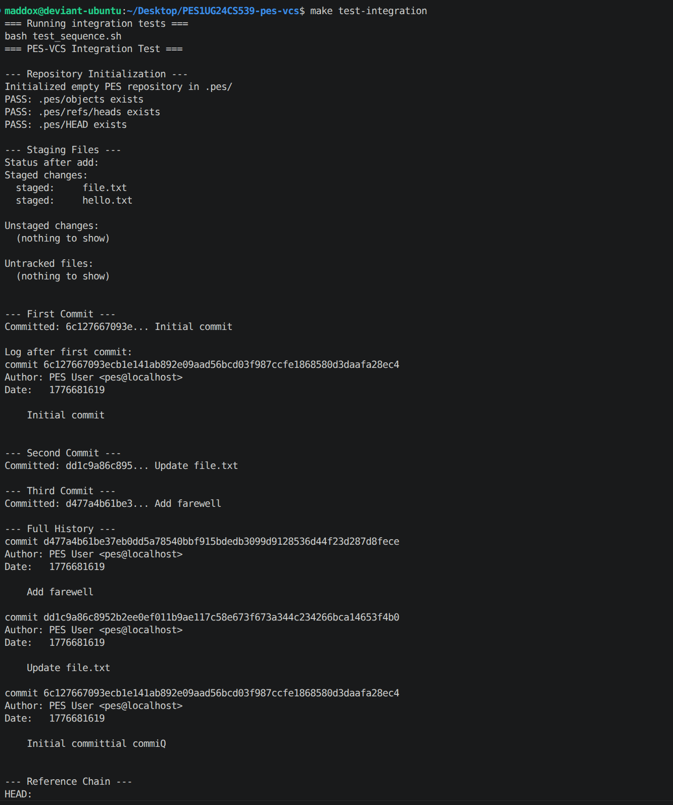

# PES-VCS

A minimal version control system implemented in C to understand how Git works internally.

This project implements:
- Content-addressable object storage (blob, tree, commit)
- A staging index
- Commit creation and history traversal
- End-to-end integration workflow

It also includes design answers for advanced topics:
- Q5.1 checkout
- Q5.2 dirty working directory detection
- Q5.3 detached HEAD
- Q6.1 garbage collection algorithm
- Q6.2 GC race condition

## 1. Build and Run

### Prerequisites

- gcc
- OpenSSL development headers and library (`libssl-dev`)

Install (Ubuntu):

```bash
sudo apt update
sudo apt install -y build-essential gcc libssl-dev
```

### Build Commands

```bash
make pes            # Build main binary
make test_objects   # Build Phase 1 test
make test_tree      # Build Phase 2 test
make test           # Run unit + integration tests
make clean          # Clean artifacts and .pes
```

### CLI Commands

```bash
./pes init
./pes add <file>...
./pes status
./pes commit -m "message"
./pes log
```

## 2. Repository Layout

- `object.c`: Blob/tree/commit object read-write and integrity verification
- `tree.c`: Tree parse/serialize and tree construction from index
- `index.c`: Staging area load/save/add/status
- `commit.c`: Commit creation, HEAD/ref update, log walk
- `pes.c`: CLI command dispatch
- `test_objects.c`: Phase 1 unit tests
- `test_tree.c`: Phase 2 unit tests
- `test_sequence.sh`: Integration test sequence
- `assets/`: Evidence screenshots

## 3. Data Formats

### Object Format

All objects are stored as:

```text
"<type> <size>\0<data>"
```

Hashing rule:
- SHA-256 is computed over the full byte stream (header + data)
- Object path is derived from hash:
  - directory: first 2 hex chars
  - filename: remaining 62 hex chars

### Tree Entry Format

Each entry is serialized as:

```text
"<mode-octal> <name>\0<32-byte-binary-hash>"
```

### Index File Format

One text entry per line in `.pes/index`:

```text
<mode-octal> <64-char-hash> <mtime-seconds> <size> <path>
```

### Commit Object Format

```text
tree <tree-hash>
parent <parent-hash>          # omitted for first commit
author <name> <timestamp>
committer <name> <timestamp>

<message>
```

## 4. Phase-wise Implementation and Evidence

### Phase 1: Object Storage

Implemented:
- Object write with atomic temp-file + rename
- Deduplication using content hash
- Object read with integrity verification

Evidence:

1. Phase 1 implementation commits and push history:



2. Phase 1 unit tests passing:


3. Sharded object store paths under `.pes/objects`:


4. Raw object bytes (`xxd`) showing header + content:


### Phase 2: Tree Objects

Implemented:
- Deterministic tree serialization (sorted entries)
- Safe tree parsing
- Tree object generation from staged index entries (including nested paths)

Evidence:


### Phase 3: Index (Staging Area)

Implemented:
- `index_load`: parse index file into memory
- `index_save`: atomic save with sorted entries
- `index_add`: stage file content as blob and update metadata
- `index_status`: staged/unstaged/untracked reporting

Evidence:

1. `init`, `add`, `status` workflow and resolved staging flow:


2. Stored `.pes/index` entries:


### Phase 4: Commit and Log

Implemented:
- Build root tree from index
- Create commit object with optional parent
- Update branch reference through HEAD
- Walk commit history with `pes log`

Evidence:

1. Clean rebuild, first commit, and log output:


2. `.pes` internal files after commit:


3. HEAD and branch reference correctness:


## Integration Test Evidence

End-to-end test (`make test-integration`) output:



## 5. Q5 Answers

### Q5.1 - `pes checkout <branch>`

Goal:
- Switch branch pointer in `.pes/HEAD`
- Materialize target commit's tree into working directory
- Delete files present in old tree but absent in new tree
- Avoid partial switch state

Recommended safe algorithm:

1. Acquire checkout lock (for example `.pes/checkout.lock`).
2. Resolve current HEAD branch and current commit/tree.
3. Resolve target branch, target commit, and target tree.
4. Run dirty check (Q5.2). If dirty, abort checkout.
5. Build two maps:
	- old snapshot: `path -> blob-hash`
	- new snapshot: `path -> blob-hash`
6. For each file in new snapshot:
	- read blob content
	- write to `path.tmp`
	- fsync temp file
	- rename `path.tmp` to final path
7. For each file in old snapshot that is not in new snapshot:
	- delete from working directory
8. Atomically update `.pes/HEAD` to `ref: refs/heads/<branch>`.
9. Release lock.

Failure handling:
- If any file write fails, stop and keep HEAD unchanged.
- This ensures no branch pointer points to a half-updated working tree.

### Q5.2 - Dirty Working Directory Detection

Goal:
- Refuse checkout when tracked files have unstaged content changes.

Algorithm:

1. For every entry in index:
	- read filesystem metadata using `stat`
2. If both `mtime` and `size` match index:
	- treat as clean, continue
3. If metadata differs:
	- read file content
	- compute SHA-256 blob hash using object header format
	- compare against hash stored in index
4. If any mismatch is found:
	- mark working directory dirty
	- reject checkout

Why this is efficient:
- Fast path uses metadata only
- Expensive hashing runs only on candidates whose metadata changed

### Q5.3 - Detached HEAD

Definition:
- HEAD contains a raw commit hash instead of `ref: refs/heads/<branch>`.

Behavior:
- New commits are still created
- No branch pointer is advanced
- Those commits can become hard to reach later

Recovery:

```bash
git branch <name> <detached-commit-hash>
```

Equivalent PES concept:
- Create `.pes/refs/heads/<name>` containing the detached commit hash
- Point `.pes/HEAD` to `ref: refs/heads/<name>`

## 6. Q6 Answers

### Q6.1 - Garbage Collection Algorithm

Objective:
- Remove unreachable objects from `.pes/objects`

Mark-and-sweep design:

1. Enumerate all branch refs in `.pes/refs/heads/*`.
2. Initialize DFS/BFS stack with referenced commit hashes.
3. While stack not empty:
	- pop object hash
	- if already visited, continue
	- mark as reachable
	- parse object by type:
	  - commit: push tree hash and parent hash (if present)
	  - tree: push child blob/tree hashes
	  - blob: no outgoing edges
4. Sweep phase:
	- iterate all object files in `.pes/objects`
	- delete any object not in reachable set

Complexity:
- Mark phase: `O(V + E)` over object graph
- Sweep phase: `O(N)` over on-disk objects
- With 100,000 commits and about 10 objects each, roughly 1,000,000 objects may be visited

Practical implementation notes:
- Use iterative traversal to avoid recursion depth issues
- Keep reachable hashes in a hash set for `O(1)` lookup

### Q6.2 - GC Race Condition

Race scenario:

1. Thread A (commit) writes a new blob.
2. Thread B (GC) scans refs before commit object is written.
3. GC sees blob as unreachable and deletes it.
4. Thread A writes commit/tree referencing missing blob.
5. Repository becomes inconsistent.

How Git avoids this:
- Lock files for operations that mutate references or object namespace
- Grace period policy (recent objects are not collected)

Recommended PES safeguards:

1. Acquire repository-wide GC lock before sweep.
2. During GC, block commit/ref-update operations or use ref transaction locks.
3. Skip deleting objects newer than a grace window (for example 2 weeks).
4. Keep object creation atomic (`tmp` + `rename`) and ref updates atomic.

## 7. Current Scope and Future Work

Implemented in CLI today:
- `init`, `add`, `status`, `commit`, `log`

Design-only in this README (not yet exposed as CLI commands):
- `checkout`
- `gc`
- explicit detached-HEAD command flow

Future improvements:
- Recursive untracked file scanning
- Branch creation/listing/deletion commands
- Checkout with conflict handling
- Incremental and concurrent-safe garbage collection

## 8. Quick Validation Commands

```bash
make clean
make all
./test_objects
./test_tree
make test-integration
```

